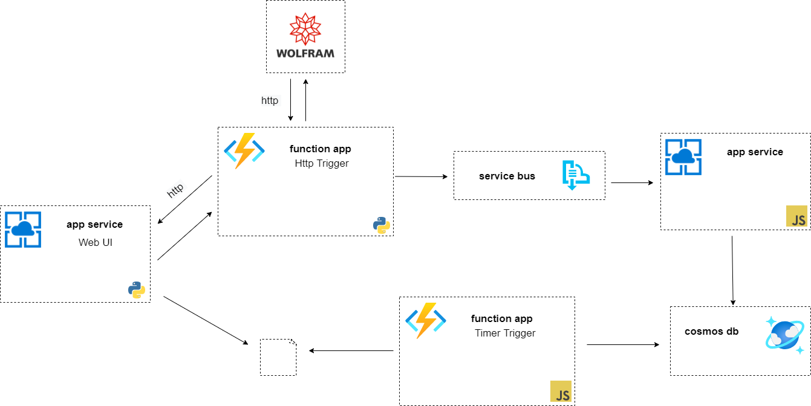

# fancy-calculator

### dev-ops course project by:
* [Denys Datsko](https://github.com/ddatsko)
* [Nazar Pasternak](https://github.com/heeveG)
* [Danylo Sahaidak](https://github.com/sotnyk-lv)
* [Viacheslav Bernadzikovskyi]()

This is smart multi-service web calculator.

It uses [Azure](https://azure.microsoft.com/en-us/) servises and [WolframAlpha](https://products.wolframalpha.com/api/) api.

## Diagram:

